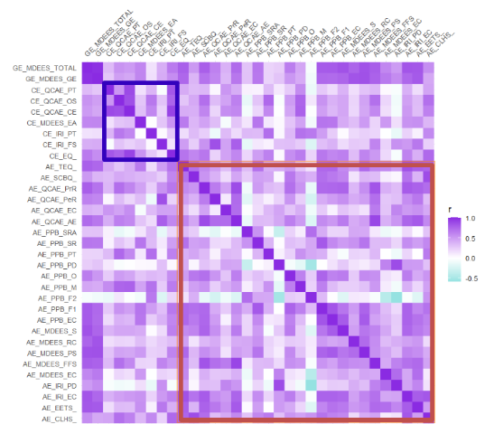
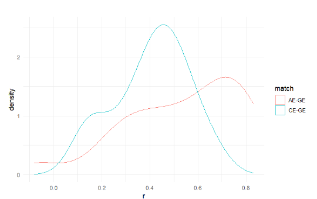

# Validation of empathy questionnaires
Empathy is measured using numerous questionnaires, many of which claim to assess the same constructs but differ in their focus and structure. This project validates empathy measures by examining trait (cognitive & affective) and state empathy, ensuring they reliably capture these constructs.

- **Trait Empathy** refers to a person's general tendency or disposition to experience empathy across various situations, typically measured through questionnaires assessing cognitive and affective components.  
- **State Empathy** refers to the temporary emotional experience or response to a specific situation, often assessed in response to a particular event or context.
  
The R code in this repository processes survey data, computes reliability metrics, and assesses factor structures to evaluate how well these questionnaires align with theoretical empathy dimensions.

### **Questionnaires were extracted for use based on their common application in the literature, but were limited to those with available open-access scoring metrics.**

The questionnaires analysed include:
## **Table 1: Trait Empathy Questionnaires**  
Extracted due to their common use in the literature.  

| Trait Empathy Questionnaire | Abbreviation | Number of Questions | Empathy Measured |
|--------------|-------------|--------------------|------------------|
| Empathy Quotient (Baron-Cohen & Wheelwright, 2004) | EQ | 60 (20 fillers) | Cognitive |
| Multi-Dimensional Emotional Empathy Scale (Caruso & Mayer, 1998) | MDEES | 30 | Cognitive & Affective |
| Compassionate Love for Humanity Scale (Sprecher & Fehr, 2005) | CLHS | 21 | Affective |
| Interpersonal Reactivity Index (Davis, 1980) | IRI | 28 | Cognitive & Affective |
| Penner Prosocial Personality Battery (Penner et al., 1995) | PPB | 56 | Affective |
| Questionnaire of Cognitive and Affective Empathy (Reniers et al., 2011) | QCAE | 31 | Cognitive & Affective |
| Relational Compassion Scale (Hacker, 2008) | RCS | 16 | Affective |
| Santa Clara Brief Compassion Scale (Hwang, Plante & Lackey, 2008) | SCBCS | 5 | Affective |
| Toronto Empathy Questionnaire (Spreng et al., 2009) | TEQ | 16 | Affective |
| Emotional Empathic Tendency Scale (Mehrabian & Epstein, 1972) | EETS | 33 | Affective |

Additionally, a **correlation map** was generated to explore the relationships between various **trait empathy questionnaires**, focusing on clustering of **cognitive** and **affective** empathy constructs. This map reveals patterns of similarity and divergence across the measures, providing insights into how different questionnaires capture the cognitive and affective dimensions of empathy.

When a **General Empathy (GE)** construct was introduced, it revealed that **GE** correlated with both **Affective Empathy (AE)** and **Cognitive Empathy (CE)** constructs, as measured by questionnaires (Figure 5). Despite there not being much difference between **Cognitive Empathy-General Empathy (CE-GE)** and **Affective Empathy-General Empathy (AE-GE)** correlations, **GE** correlates much more strongly with **AE** than with **CE**.

## **Table 2: State Empathy Questionnaires**  
Extracted for use, due to their frequent use in the literature.  

| Questionnaire | Abbreviation | Number of Questions | Empathy Measured |
|--------------|-------------|--------------------|------------------|
| Inclusion of the Other in the Self Scale (Aron et al., 1992) | IOS | 1 | State Empathy |
| Measure of State Empathy (Shen, 2010) | MSE | 12 | State Empathy |

This work was presented at **ISRE 2024**, and the report can be accessed [here](https://osf.io/fjaux).
